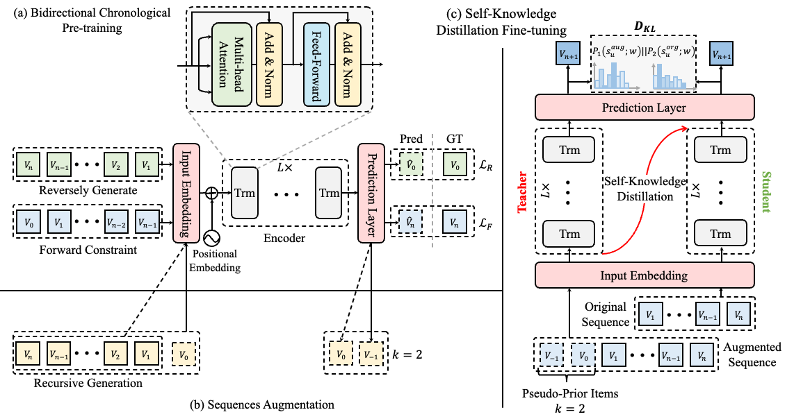
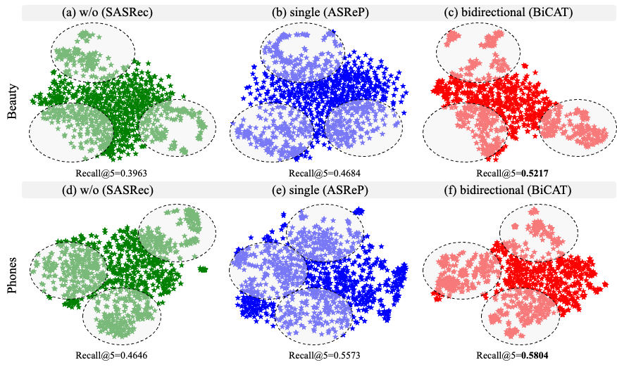

# BiCAT: Self-Knowledge Distillation with Bidirectional Chronological Augmentation of Transformer for Sequential Recommendation
Juyong Jiang, Yingtao Luo, Jae Boum Kim, Kai Zhang, Sunghun Kim\*

(\*) Corresponding Author.

This is our TensorFlow implementation for the paper: "**[Self-Knowledge Distillation with Bidirectional Chronological Augmentation of Transformer for Sequential Recommendation](https://arxiv.org/abs/2112.06460)**".
Our code is implemented based on TensorFlow version of [SASRec](https://github.com/kang205/SASRec) and [ASReP](https://github.com/DyGRec/ASReP). More useful repositories can be found in our [@AIM (DeepSE) Lab](https://github.com/AIM-SE).

## Paper Abstract
Sequential recommendation can capture user chronological preferences from their historical behaviors, yet the learning of short sequences (cold-start problem) in many benchmark datasets is still an open challenge. Recently, data augmentation with pseudo-prior items generated by Transformers has drawn considerable attention. These methods can generate pseudo-prior items sequentially in reverse chronological order to extend the original sequences. Nevertheless, the performance may still dramatically degrade in very short sequences; most notably, the generation of pseudo-prior items does not take into account the forward direction (from the past to the future), and so the underlying temporal correlations are not preserved in terms of conditional probabilities. Motivated by this, we propose a Bidirectional Chronological Augmentation of Transformer (BiCAT) that uses a forward learning constraint in the reverse generative process to capture contextual information more effectively. Then, self-knowledge distillation is adopted in augmented and original sequences to bridge the gap between data augmentation and model representation, which enhances the robustness of sequence encoder. Moreover, an informative positive and negative sampling strategy is proposed to accelerate optimization and prevent overfitting. Extensive experiments on two popular real-world datasets demonstrate the efficacy of our method on very short sequences ($L \le 3$) and long sequences ($20 < L \le 50$) as well, our approach outperforms state-of-the-art models by an average of 35.04\% and 8.76\% respectively, in terms of Recall@5. 

<p align="center">
  
  <br>
  <b>Figure 1.</b> The model architecture of proposed BiCAT consists of three parts: (a) Bidirectional Chronological Pre-training aims to predict prior items (dashed blocks) of sequences with consistent semantic correlation for the next item prediction task; (b) Sequences Augmentation is to generate $k$ pseudo-prior items for short sequences that sequence length is less than threshold M; (c) Self-Knowledge Distillation Fine-tuning is to feed augmented and original sequences to fine-tuning the model for the next item ($v_{n+1}$) prediction with distributed regularization loss.
</p>

## Installation
Make sure you have `Python>=3.6` and `Tensorflow>=1.12` installed on your machine. 

* TensorFlow 1.12
* Python 3.6.*

Modify the last line `prefix: /home/user/anaconda3/envs/bicat` in `requirements.yml` according to your machine. 

Install python dependencies by running:

```bash
conda env create -f requirements.yml
```

## Datasets Prepare
**Benchmarks**: Amazon Review datasets Beauty, Movie Lens and Cell_Phones_and_Accessories. 
The data split is done in the `leave-one-out` setting. Make sure you download the datasets from the [link](https://jmcauley.ucsd.edu/data/amazon/). Please, use the `DataProcessing.py` under the `data/`, and make sure you change the DATASET variable value to your dataset name, then you run:

```
python DataProcessing.py
```

You will find the processed dataset in the directory with the name of your input dataset.

## Beauty
**1. Reversely Pre-training and Short Sequence Augmentation**

Pre-train the model and output 20 items for sequences with length <= 20.

```
python -u main.py --dataset=Beauty \
                  --lr=0.001 --maxlen=100 --dropout_rate=0.7 --evalnegsample=100 \
                  --hidden_units=128 --num_blocks=2 --num_heads=4 \
                  --reversed=1 --reversed_gen_num=50 --M=50 \ 
                  2>&1 | tee pre_train.log
```
**2. Next-Item Prediction with Reversed-Pre-Trained Model and Augmented dataset**

```
python -u main.py --dataset=Beauty \
                  --lr=0.001 --maxlen=100 --dropout_rate=0.7 --evalnegsample=100 \
                  --hidden_units=128 --num_blocks=2 --num_heads=4 \
                  --reversed_pretrain=1 --aug_traindata=47 --M=50 \
                  2>&1 | tee fine_tune.log
```

## Cell_Phones_and_Accessories
**1. Reversely Pre-training and Short Sequence Augmentation**

Pre-train the model and output 20 items for sequences with length <= 20.

```
python -u main.py --dataset=Cell_Phones_and_Accessories \
                  --lr=0.001 --maxlen=100 --dropout_rate=0.5 --evalnegsample=100 \
                  --hidden_units=32 --num_blocks=2 --num_heads=2 \
                  --reversed=1 --reversed_gen_num=50 --M=50 \ 
                  2>&1 | tee pre_train.log
```
**2. Next-Item Prediction with Reversed-Pre-Trained Model and Augmented dataset**

```
python -u main.py --dataset=Cell_Phones_and_Accessories \
                  --lr=0.001 --maxlen=100 --dropout_rate=0.5 --evalnegsample=100 \
                  --hidden_units=128 --num_blocks=2 --num_heads=2 \
                  --reversed_pretrain=1 --aug_traindata=47 --M=50 \
                  2>&1 | tee fine_tune.log
```

`or`

For the sake of simplicity, you can just run the following simple command:

```bash
[option] sh run_pre_train.sh # if pre-trained model is available, it can be skipped.
sh run_fine_tuning.sh
```

## Generated Pseudo-Prior Items
|  Dataset   |                                   Generated Pseudo-Prior Items                             |   Size  | Recall@5 | NDCG@5 |  MRR |
| :------- | :----------------------------------------------------------------------------------------- | -------:| ---------:| ------:| ------:|
| Beauty   | `https://github.com/juyongjiang/BiCAT/tree/master/aug_data/Beauty` | 3.6 MiB | 52.17% | 38.92% |   37.59% |
| Phones   | `https://github.com/juyongjiang/BiCAT/tree/master/aug_data/Cell_Phones_and_Accessories` | 4.9 MiB | 58.04% | 43.71% |   41.95% |


## Pre-trained Models
So you can run the following command to fine-tuning with pre-trained models:

```bash
sh run_fine_tuning.sh
```

|  Dataset   |                                   Pre-trained checkpoint                                   |   Size  | Recall@5 | NDCG@5 |  MRR |
| :------- | :----------------------------------------------------------------------------------------- | -------:| ---------:| ------:| ------:|
| Beauty   | `https://github.com/juyongjiang/BiCAT/tree/master/reversed_models/Beauty_reversed` | 22 MiB | 52.17% | 38.92% |   37.59% |
| Phones   | `https://github.com/juyongjiang/BiCAT/tree/master/reversed_models/Cell_Phones_and_Accessories_reversed` | 5.9 MiB | 58.04% | 43.71% |   41.95% |

## Item Embeddings Visualization
We analyze item embeddings by t-SNE visualization method to verify that the items with similar semantics can be clustered more closely, and vice versa. The item embeddings numpy array is available as follows.

|  Dataset   |                                   Item Embeddings Numpy Array           |   Size  | Recall@5 | NDCG@5 |  MRR |
| :------- | :----------------------------------------------------------------------------------------- | -------:| ---------:| ------:| ------:|
| Beauty   | `https://github.com/juyongjiang/BiCAT/blob/master/Beauty_bicat_embs.npy` | 22 MiB | 52.17% | 38.92% |   37.59% |
| Phones   | `https://github.com/juyongjiang/BiCAT/blob/master/Cell_Phones_and_Accessories_bicat_embs.npy` | 5.9 MiB | 58.04% | 43.71% |   41.95% |

The results of randomly selected 1,000 items from the whole set of items is as shown in following. 

<p align="center">
  
  <br>
  <b>Figure 2.</b> Visualization of randomly selected 1,000 item embeddings using t-SNE for Beauty (a-c) and Phones (d-f) dataset. The proposed BiCAT (c)(f) significantly enhance the cluster of items with similar semantics (gray circular region)  that leads to the best Recall@5.
</p>

## Bibtex
Please cite our paper if you find our code or paper useful:
```bibtex
@article{jiang2021sequential,
  title={Sequential Recommendation with Bidirectional Chronological Augmentation of Transformer},
  author={Jiang, Juyong and Luo, Yingtao and Kim, Jae Boum and Zhang, Kai and Kim, Sunghun},
  journal={arXiv preprint arXiv:2112.06460},
  year={2021}
}
```

## Contact
Feel free to contact us if there is any question. (Juyong Jiang, juyongjiang@ust.hk; Russell KIM, russellkim@upstage.ai)
